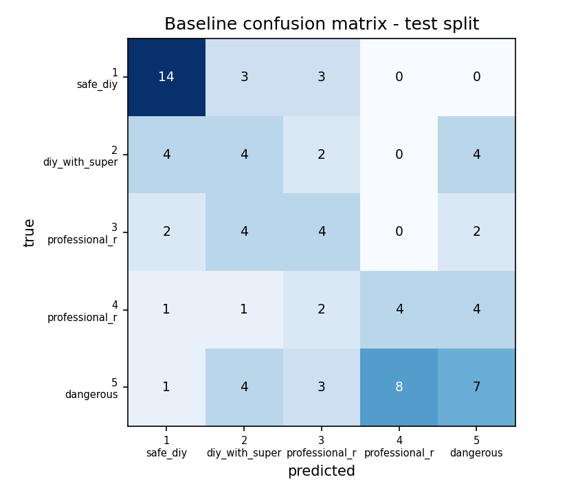

# Baseline Model — Evaluation Report (Phase 3)

TF-IDF + Logistic Regression. Reproduce with `python ml/train_baseline.py`.
Selected on the validation split: `C=10.0`,
word n-grams `(1, 2)` (val macro-F1 0.372).

## Features — and what was deliberately excluded

Inputs are limited to what the backend actually has at assessment time:
`task_text`, `category`, `user_skill`.

`tools_available` is in the dataset but is **not** a feature: the backend has
no tools column and intake never asks, so training on it would be train/serve
skew. Fitting with it scored macro-F1 0.613, but serving it blanked — which is
all production could ever do — dropped that to 0.549. The numbers below are
therefore what the model will actually deliver.

Every other field in a row is an **output** of the assessment and would leak the
label. This is not a theoretical concern — measured on the 555 rows:

| Field | Relationship to the label |
|---|---|
| `professional_category` | `is None` ⟺ `risk_level <= 2`, exactly, 555/555 rows |
| `suggested_ppe` | `== []` whenever `risk_level == 5` |
| `followup_questions` | an unanswered safety-critical follow-up ⟹ `risk_level == 5`, all 59 rows |
| `hazards` | 37 of 66 distinct hazard sets map to exactly one risk level |

Follow-up state is excluded for a second reason: escalating on a missing
safety-critical answer is the **rule engine's** job, and `final_risk = max(ML,
rules)` combines the two. Feeding it here would make the ML half relearn the
rule half and report a flattering number for work the rules already do.

## Headline results

Metrics on generated rows partly measure the paraphrase generator rather than
the task, so the hand-written subset is the number to trust.

| | test (all 81) | test (hand-written 40) |
|---|---|---|
| accuracy | 0.407 | 0.425 |
| macro F1 | 0.385 | 0.411 |
| high-risk recall (≥4 caught as ≥4) | 0.657 | 0.647 |
| 95% CI on that recall | [0.492, 0.792] | [0.413, 0.827] |
| under-prediction rate (all) | 0.370 | 0.350 |
| under-prediction rate (high-risk) | 0.571 | 0.588 |
| under-predicted by ≥2 levels | 12 | 6 |

### The classifier is not the whole safety story

The system ships `final_risk = max(ML, rules)` (`architecture.md` §2, `srs.md` §8.1),
and the classifier is deliberately blind to follow-up state so the rule engine
can own that escalation. **ML-only recall therefore understates the deployed
system.** Simulating just the "unanswered safety-critical follow-up ⟹ 5" rule
on top of these predictions:

| | ML alone | max(ML, rules) |
|---|---|---|
| high-risk recall, test (all) | 0.657 | **0.743** |
| high-risk recall, hand-written | 0.647 | **0.706** |
| high-risk rows rescued by the rule | — | 3 |

That is still a floor, not a ceiling: only the follow-up rule is simulated here.
The real engine also carries keyword hazard rules, so the deployed system
escalates strictly more than this table shows.

### Grouped 5-fold cross-validation (all 555 rows)

A single 82-row test split is thin. This CV groups by `group_id`, so a seed and
its variants never straddle a fold — it is the more stable estimate.

- macro F1 **0.344 ± 0.082**
- high-risk recall **0.633 ± 0.072**

## Why "high-risk recall" is reported collapsed

Per-class recall punishes predicting 5 when the truth is 4, which is not a
safety failure — the system escalates and the user is told to get a
professional. What matters is whether a genuinely dangerous task is *recognised
as* dangerous. So the headline number is: of tasks truly at level 4–5, what
fraction were predicted at 4–5. The **under-prediction rate** is the direct
measure of the failure mode `prd.md` §7 targets.

## Per-class detail — test (all rows)

| risk level | precision | recall | F1 | support |
|---|---|---|---|---|
| 1 — safe_diy | 0.64 | 0.70 | 0.67 | 20 |
| 2 — diy_with_supervision | 0.25 | 0.29 | 0.27 | 14 |
| 3 — professional_recommended | 0.29 | 0.33 | 0.31 | 12 |
| 4 — professional_required | 0.33 | 0.33 | 0.33 | 12 |
| 5 — dangerous | 0.41 | 0.30 | 0.35 | 23 |

### Confusion matrix — test (all rows)

| true \ pred | 1 | 2 | 3 | 4 | 5 |
|---|---|---|---|---|---|
| **1** | 14 | 3 | 3 | 0 | 0 |
| **2** | 4 | 4 | 2 | 0 | 4 |
| **3** | 2 | 4 | 4 | 0 | 2 |
| **4** | 1 | 1 | 2 | 4 | 4 |
| **5** | 1 | 4 | 3 | 8 | 7 |

## Per-class detail — test (hand-written only)

| risk level | precision | recall | F1 | support |
|---|---|---|---|---|
| 1 — safe_diy | 0.78 | 0.70 | 0.74 | 10 |
| 2 — diy_with_supervision | 0.38 | 0.43 | 0.40 | 7 |
| 3 — professional_recommended | 0.22 | 0.33 | 0.27 | 6 |
| 4 — professional_required | 0.33 | 0.33 | 0.33 | 6 |
| 5 — dangerous | 0.38 | 0.27 | 0.32 | 11 |

## Limitations

1. **Small test set.** 40 hand-written rows; high-risk recall rests on
   17 examples. The confidence interval above is wide — quote it,
   not the point estimate.
2. **Weak labels in training.** 299 of 555 rows are generated paraphrases
   inheriting a parent's label, so effective sample size is well below 555.
3. **Label ceiling.** `ml/data/REVIEW.md` records that labels were
   standards-audited but never reviewed by a domain expert. The model cannot be
   more correct than its labels.
4. **No calibration.** Predicted probabilities are unvalidated; `srs.md` stores a
   confidence with each assessment, so calibration should be checked before that
   value is shown to users or used for thresholding.
5. **This is a baseline.** Phase 4 compares it against sentence-embedding
   features; the decision on which ships is recorded there.

## Phase 3 exit check

> "baseline recall on high-risk classes measured and documented (even if not yet at target)"

Measured and documented above. Target for reference (`prd.md` §7, provisional):
≥95% recall on the two most severe classes.
