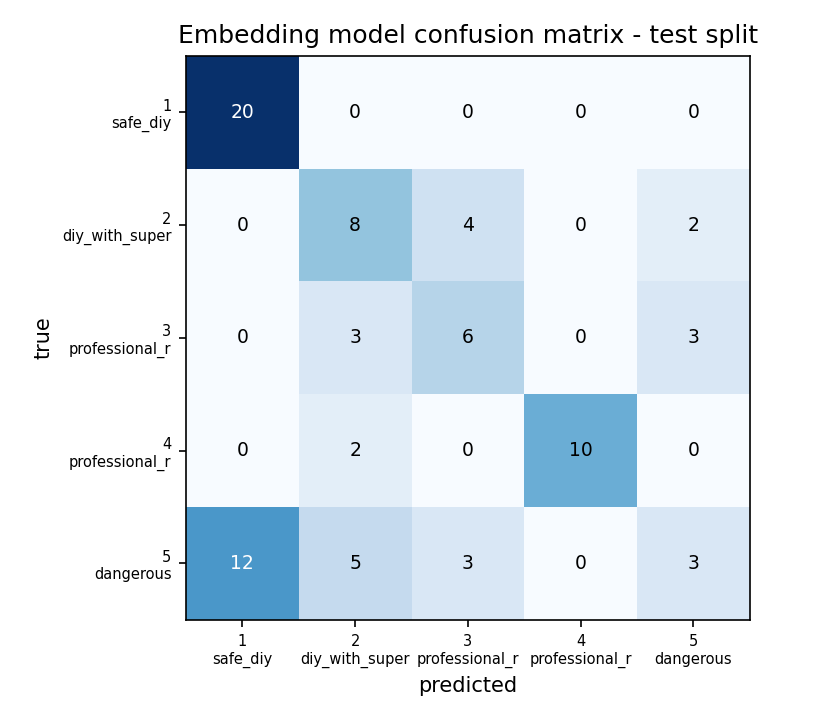

# Phase 4 — Baseline vs Embedding Model

Reproduce: `python ml/train_baseline.py && python ml/train_embedding_model.py`.

| | Baseline (Phase 3) | Embedding (Phase 4) |
|---|---|---|
| representation | TF-IDF word + char n-grams | `all-MiniLM-L6-v2` sentence embeddings (384-d, frozen) |
| head | Logistic Regression, `class_weight=balanced` | Logistic Regression, `class_weight=balanced` |
| inputs | `task_text`, `category`, `user_skill` | identical |

Both models are scored by the same code (`ml/evaluation.py`) on the same splits,
so the comparison isolates the representation.

## Held-out test split

Hand-written rows are the trustworthy view — generated rows are paraphrases and
partly measure the generator.

**All test rows (n=81)**

| metric | baseline | embedding | change |
|---|---|---|---|
| accuracy | 0.630 | 0.580 | ▼ -0.049 |
| macro F1 | 0.620 | 0.570 | ▼ -0.050 |
| high-risk recall (≥4 as ≥4) | 0.514 | 0.371 | ▼ -0.143 |
| under-prediction rate | 0.284 | 0.309 | ▲ +0.025 |

**Hand-written test rows only (n=40)**

| metric | baseline | embedding | change |
|---|---|---|---|
| accuracy | 0.625 | 0.575 | ▼ -0.050 |
| macro F1 | 0.614 | 0.562 | ▼ -0.051 |
| high-risk recall (≥4 as ≥4) | 0.529 | 0.353 | ▼ -0.176 |
| under-prediction rate | 0.275 | 0.300 | ▲ +0.025 |

⚠️ **Do not decide from this table alone.** With n=40 the 95% CI on high-risk
recall spans roughly ±0.2, which is wider than any plausible difference between
the two models. It is reported for completeness; the decision rests on the
paired CV below.

## Paired grouped 5-fold cross-validation — the basis for the decision

Both models trained and scored on **identical folds** over all 555 rows, grouped
so a seed and its variants never straddle a fold.

| fold | base macro-F1 | emb macro-F1 | Δ | base HR recall | emb HR recall | Δ |
|---|---|---|---|---|---|---|
| 1 | 0.668 | 0.623 | -0.045 | 0.725 | 0.675 | -0.050 |
| 2 | 0.675 | 0.603 | -0.072 | 0.634 | 0.683 | +0.049 |
| 3 | 0.645 | 0.667 | +0.022 | 0.659 | 0.683 | +0.024 |
| 4 | 0.613 | 0.578 | -0.036 | 0.585 | 0.659 | +0.073 |
| 5 | 0.498 | 0.584 | +0.086 | 0.659 | 0.634 | -0.024 |

| | baseline | embedding | mean Δ | folds embedding wins |
|---|---|---|---|---|
| macro F1 | 0.620 ± 0.065 | 0.611 ± 0.032 | **-0.009** ± 0.056 | 2/5 |
| high-risk recall | 0.652 ± 0.045 | 0.667 ± 0.019 | **+0.014** ± 0.046 | 3/5 |

## Decision — which model ships

**Ships:** the **baseline (TF-IDF + Logistic Regression)**.

neither difference clears the fold-to-fold noise — macro F1 -0.009 (±0.056), high-risk recall +0.014 (±0.046). With no measurable gain, the tie is broken on cost: the baseline is a few hundred KB of scikit-learn with no extra runtime dependency, while the embedding model adds torch and a ~90 MB download to the serving path. Complexity that does not buy accuracy is not worth deploying.

Both artifacts are kept (`ml/eval/baseline_model.joblib`, `ml/eval/embedding_model.joblib`) per `architecture.md` §1, which specifies keeping both models and an evaluation report comparing them.

## Per-class detail — embedding model, test (all rows)

| risk level | precision | recall | F1 | support |
|---|---|---|---|---|
| 1 — safe_diy | 0.62 | 1.00 | 0.77 | 20 |
| 2 — diy_with_supervision | 0.44 | 0.57 | 0.50 | 14 |
| 3 — professional_recommended | 0.46 | 0.50 | 0.48 | 12 |
| 4 — professional_required | 1.00 | 0.83 | 0.91 | 12 |
| 5 — dangerous | 0.38 | 0.13 | 0.19 | 23 |

### Confusion matrix

| true \ pred | 1 | 2 | 3 | 4 | 5 |
|---|---|---|---|---|---|
| **1** | 20 | 0 | 0 | 0 | 0 |
| **2** | 0 | 8 | 4 | 0 | 2 |
| **3** | 0 | 3 | 6 | 0 | 3 |
| **4** | 0 | 2 | 0 | 10 | 0 |
| **5** | 12 | 5 | 3 | 0 | 3 |

## Caveats carried forward

1. Neither model is close to `prd.md` §7's provisional ≥95% recall on the two
   most severe classes. The rule engine, not the classifier, is what makes the
   deployed system safe — `final_risk = max(ML, rules)`.
2. 256 hand-written examples is thin for 5-way ordinal classification; both
   models are data-limited, and more labelled data would very likely move the
   numbers more than any change of representation.
3. Neither model's probabilities are calibrated, yet `srs.md` stores a
   confidence per assessment. Calibrate before that value is shown to users.
4. The embedding model adds a ~90 MB model download and a torch dependency to
   the serving path; the baseline is a few hundred KB of scikit-learn.
