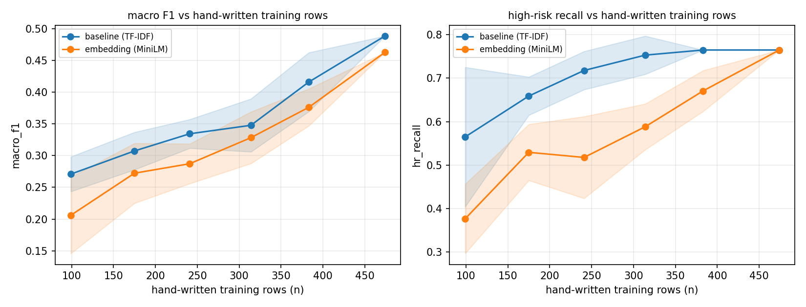

# Learning curve — baseline vs embedding vs hand-written data volume

Reproduce: `python ml/learning_curve.py`. Answers: how much more hand-written
data (beyond the current 256 rows) would
it take to move `comparison_report.md`'s ship decision?

Method: for each training size, 5 random draws of that many hand-written
GROUPS (a seed row + its own generated paraphrases, never split — same
grouping every other script here uses) are sampled from `train.json` +
`val.json` (only 210 hand-written groups
exist there to draw from). Both models are refit per draw with their
already-selected hyperparameters and scored against the SAME fixed,
never-sampled hand-written test rows (n=40, from `test.json`).
Reported values are the mean ± std across the 5 draws.

**"training rows (n)" is NOT a pure hand-written count.** Sampling by group
(to avoid a seed and its own paraphrase leaking across a fold) pulls in each
sampled seed row's generated variants too - at full pool size n=474 rows
covers 216 hand-written rows plus 258 of their generated variants (~46%
hand-written). The ratio is roughly constant across draws, so the trend below
is meaningful, but "n" should be read as "hand-written examples plus their
natural paraphrases", not literal hand-written volume - divide by roughly
2.2 for a hand-written-only estimate.

## Observed points

| training rows (n) | baseline macro F1 | embedding macro F1 | baseline HR recall | embedding HR recall |
|---|---|---|---|---|
| 99 | 0.271 ± 0.027 | 0.206 ± 0.060 | 0.565 ± 0.160 | 0.376 ± 0.080 |
| 175 | 0.307 ± 0.030 | 0.272 ± 0.047 | 0.659 ± 0.044 | 0.529 ± 0.064 |
| 241 | 0.334 ± 0.023 | 0.287 ± 0.031 | 0.718 ± 0.044 | 0.518 ± 0.094 |
| 314 | 0.348 ± 0.042 | 0.328 ± 0.041 | 0.753 ± 0.044 | 0.588 ± 0.053 |
| 383 | 0.416 ± 0.046 | 0.376 ± 0.029 | 0.765 ± 0.000 | 0.671 ± 0.047 |
| 474 | 0.488 ± 0.000 | 0.463 ± 0.000 | 0.765 ± 0.000 | 0.765 ± 0.000 |

## Power-law extrapolation

Each curve is fit to `y = a - b / n^c` (a = projected plateau) and solved for
the n at which it is projected to close half the remaining gap to that
plateau — a rough "how much more would meaningfully help" marker, not a
promise.

- **baseline macro F1**: fit y = 1.500 - 2.05/n^0.11 (R²=0.82); currently 0.438 at n=474; ~8425 rows to close half the remaining gap to its projected plateau (1.000) ⚠️ **plateau pinned at the search bound - curve is still too early to extrapolate; treat only the observed trend as real, not this row count.**
- **embedding macro F1**: fit y = 1.500 - 2.30/n^0.12 (R²=0.88); currently 0.413 at n=474; ~6359 rows to close half the remaining gap to its projected plateau (1.000) ⚠️ **plateau pinned at the search bound - curve is still too early to extrapolate; treat only the observed trend as real, not this row count.**
- **baseline high-risk recall**: fit y = 0.870 - 10.00/n^0.76 (R²=0.99); currently 0.776 at n=474; ~1183 rows to close half the remaining gap to its projected plateau (0.870)
- **embedding high-risk recall**: fit y = 1.500 - 3.28/n^0.23 (R²=0.90); currently 0.708 at n=474; ~1145 rows to close half the remaining gap to its projected plateau (1.000) ⚠️ **plateau pinned at the search bound - curve is still too early to extrapolate; treat only the observed trend as real, not this row count.**

## Reading this

- If the embedding curve is still rising faster than the baseline's at the
  largest n tested, and/or its extrapolated plateau sits above the
  baseline's, that is direct evidence for the earlier claim that embeddings
  have more long-term headroom — and the fit above gives a concrete row
  estimate instead of a rule of thumb.
- If both curves have already flattened by n=474
  (current data), more hand-written data of the *same kind* is unlikely to
  move the ship decision — the ceiling is coming from label ambiguity between
  adjacent risk levels (`comparison_report.md`), not from volume, and effort
  is better spent on review/relabeling than on writing more examples.

## Caveats

1. **5 repeats per size** is enough to see a trend, not to bound it tightly —
   the shaded bands are ± 1 std over 5 draws, not a confidence interval.
2. **Hyperparameters are held fixed** at their current train/val-selected
   values for both models at every training size. A model refit from scratch
   at, say, 800 rows might select a different `C` or n-gram range; this curve
   answers "does more data help at today's settings", not "what is achievable
   with re-tuning at scale".
3. **The power-law fit is descriptive, not causal.** With only 6 x-values
   it can look confident (high R²) while still extrapolating a shape that
   doesn't hold beyond the tested range - treat the projected n as an
   order-of-magnitude signal, not a target to hit exactly.
4. Training draws come from `train.json` + `val.json` only; the 40-row
   hand-written test split is never sampled from, so the score at the
   right-most point is close to but not identical to the headline numbers in
   `baseline_report.md` / `comparison_report.md` (those refit on train+val
   in full, this refits on a 5-draw sample of it).
